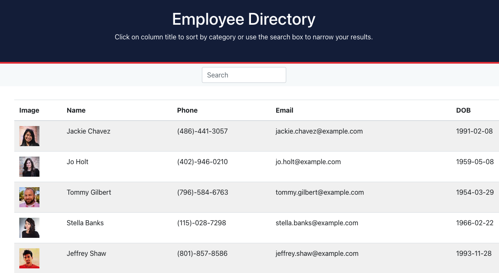

# Employee Directory  
    
  ## Description  
  This project rovides a handy directory of employees that is both sortable and seachable.  
  
  ## Table of Contents   
  [Installation](##Installation)  
  [Usage](##Usage)  
  [License](##License)  
  [Contributiing](##Contributing)  
  [Tests](##Tests)  
  [Questions](##Questions)
    
  ## Installation  
  No installation is required.  
  ## Usage  
  Upon visiting the [linked page](https://ihm57511.github.io/employee-directory/), the user may look through the employee database. If so desired, the table of employees may be sorted alphabetically by last name, in ascending or descending order, by clicking the table header "Name". Similarly the other titles may be selected to sort by phone number, email, or date of birth. The data may also be narrowed by typing in a specific name or partial name in the search field.  
  ## License   
  Licensed under the **[MIT](https://github.com/git/git-scm.com/blob/master/MIT-LICENSE.txt)** license.    
  ## Contributing  
  No guidlines exist at this time for contribution.  
  ## Tests   
  No testing instructions exist at this time.  
  ## Questions  
  I can be reached at mcbrayer.ian@gmail.com for further information.  
  Please feel free to also check out my work at https://github.com/ihm57511
